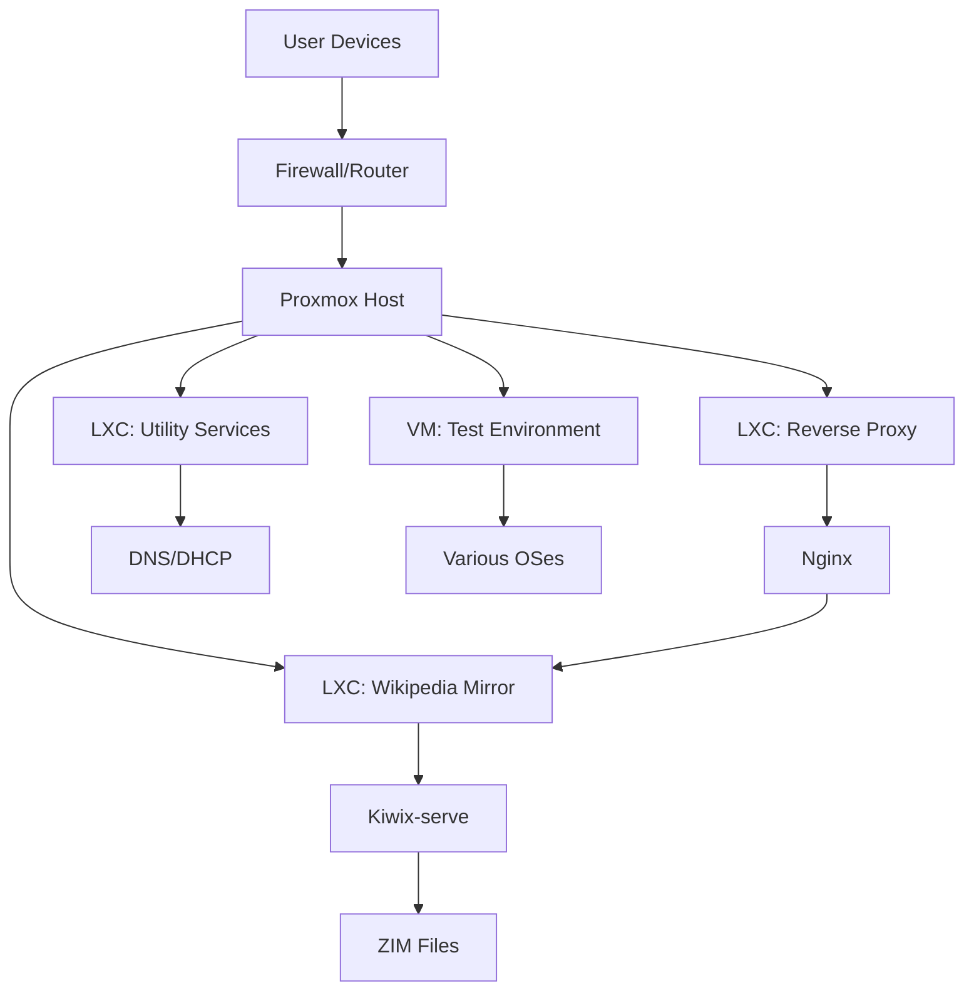

# 🖥️ Proxmox Homelab + Wikipedia Mirror Server

This project showcases my **Proxmox-based virtualization homelab** that hosts multiple services, including a **self-updating offline Wikipedia mirror** for research and educational use. The entire system is **firewalled, modular, and reproducible**, giving me full control over my infrastructure while improving my sysadmin, networking, and virtualization skills.

---

## 🚀 Project Highlights

### ✅ **Proxmox Homelab**
- Installed Proxmox VE on a dedicated machine for enterprise-grade virtualization
- Created **LXC containers** for each service (Wikipedia mirror, web apps, DNS, etc.)
- Configured **VMs for testing OS images and network scenarios**
- Implemented ZFS storage for snapshots and data integrity

### ✅ **Wikipedia Mirror Setup**
- Deployed a full **offline Wikipedia** using [Kiwix-serve](https://www.kiwix.org/)
- Automated ZIM file downloads and updates with cron jobs
- Served content over LAN, accessible by any device on my network
- Optimized storage usage with compression and cleanup scripts

### ✅ **Networking & Security**
- Configured **VLANs and network segmentation** for service isolation
- Implemented **iptables/nftables** firewall rules
- Set up **reverse proxy** with Nginx for web services
- Blocked external access while maintaining LAN availability

### ✅ **Automation & Monitoring**
- Created **Bash scripts** for automated maintenance tasks
- Set up **Proxmox backup schedules** for all containers
- Configured **resource monitoring** and alerting
- Implemented **log rotation** and system health checks

---

## 🧰 Tech Stack

| Layer | Technologies Used |
|-------|-------------------|
| **Virtualization** | Proxmox VE, LXC Containers, QEMU/KVM |
| **Operating Systems** | Debian 12, Ubuntu Server, Alpine Linux |
| **Wikipedia Hosting** | Kiwix-serve, ZIM file dumps |
| **Networking** | iptables, nftables, VLANs, Nginx reverse proxy |
| **Automation** | Bash scripting, cron jobs, Proxmox API |
| **Storage** | ZFS, LVM-Thin, compression, snapshots |
| **Monitoring** | Proxmox dashboard, custom resource scripts |

---

## 📂 Repository Structure

```
proxmox-homelab/
├── 📄 README.md
├── 📁 docs/
│   ├── 01-proxmox-installation.md
│   ├── 02-container-setup.md
│   ├── 03-network-configuration.md
│   ├── 04-wikipedia-mirror.md
│   ├── 05-security-hardening.md
│   └── 06-backup-strategy.md
├── 📁 scripts/
│   ├── update-wikipedia.sh
│   ├── container-backup.sh
│   ├── health-check.sh
│   └── firewall-setup.sh
├── 📁 configs/
│   ├── nginx-reverse-proxy.conf
│   ├── iptables-rules.v4
│   └── crontab-jobs.txt
├── 📁 screenshots/
│   ├── proxmox-dashboard.png
│   ├── lxc-containers.png
│   ├── wikipedia-mirror.png
│   └── network-diagram.png
└── 📁 backups/
    └── README-backups.md
```

---

## 🏗️ System Architecture



---

## ⚡ Quick Start

### 1. **Proxmox Installation**
```bash
# Download Proxmox VE ISO and install on bare metal
# Configure network and storage during installation
```

### 2. **Create Wikipedia Container**
```bash
# Create LXC container with Debian 12
pct create 100 debian-12-standard_12.2-1_amd64.tar.zst \
  --storage local-zfs --rootfs 8G
```

### 3. **Install Kiwix**
```bash
# Inside container
wget https://download.kiwix.org/release/kiwix-tools/kiwix-tools_linux-x86_64.tar.gz
tar xvf kiwix-tools_linux-x86_64.tar.gz
./kiwix-serve --port=8080 wikipedia_en_all_maxi_2023-11.zim
```

### 4. **Network Configuration**
```bash
# Configure bridge and VLANs in /etc/network/interfaces
auto vmbr0
iface vmbr0 inet static
    address 192.168.1.10/24
    gateway 192.168.1.1
    bridge-ports eno1
    bridge-stp off
    bridge-fd 0
```

---

## 🔧 Key Scripts

### **Automated Wikipedia Updates** (`scripts/update-wikipedia.sh`)
```bash
#!/bin/bash
# Downloads latest Wikipedia ZIM and updates service

ZIM_URL="https://download.kiwix.org/zim/wikipedia/wikipedia_en_all_maxi_$(date +%Y-%m).zim"
cd /storage/zim-files
wget -c "$ZIM_URL"
systemctl restart kiwix-serve
```

### **Container Backups** (`scripts/container-backup.sh`)
```bash
#!/bin/bash
# Backs up all LXC containers to NAS

for container in $(pct list | awk 'NR>1 {print $1}'); do
    vzdump $container --mode snapshot --storage nas-backup
done
```

---

## 🔐 Security Features

- **Network Isolation**: Services segmented with VLANs
- **Firewall Rules**: Strict iptables policies allowing only necessary ports
- **No External Exposure**: Services available on LAN only
- **Regular Updates**: Automated security patches
- **Backup Encryption**: Encrypted off-site backups

---

## 📊 Monitoring & Maintenance

**Daily Tasks:**
- Check container status and resource usage
- Verify backup completion
- Review security logs

**Weekly Tasks:**
- Update Wikipedia ZIM files
- Apply system updates
- Clean up old snapshots

**Monthly Tasks:**
- Test disaster recovery procedures
- Review and update firewall rules
- Performance optimization

---

## 🎯 Future Enhancements

- [ ] **Multi-node Proxmox Cluster** for high availability
- [ ] **Prometheus + Grafana** for advanced monitoring
- [ ] **Ansible Automation** for configuration management
- [ ] **Cloudflare Tunnels** for secure remote access
- [ ] **Docker Integration** for application isolation
- [ ] **Additional Knowledge Bases** (Kiwix library expansion)

---


## 🤝 Contributing

This project is open to suggestions and improvements! Feel free to:
- Submit issues for bugs or feature requests
- Fork the repository and create pull requests
- Share your own homelab configurations

---

## 📄 License

This project is licensed under the MIT License - see the [LICENSE](LICENSE) file for details.

---

## 🙌 Acknowledgments

- [Kiwix](https://www.kiwix.org/) for making offline knowledge accessible
- [Proxmox VE](https://www.proxmox.com/) for robust virtualization platform
- Wikipedia contributors for creating amazing free knowledge resources

---

**⭐ If you find this project helpful, please give it a star on GitHub!**
